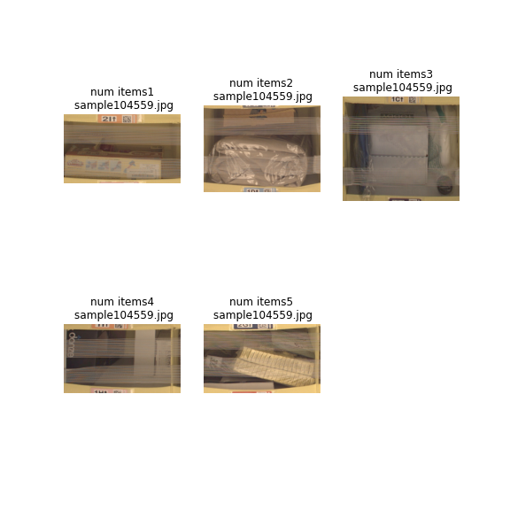
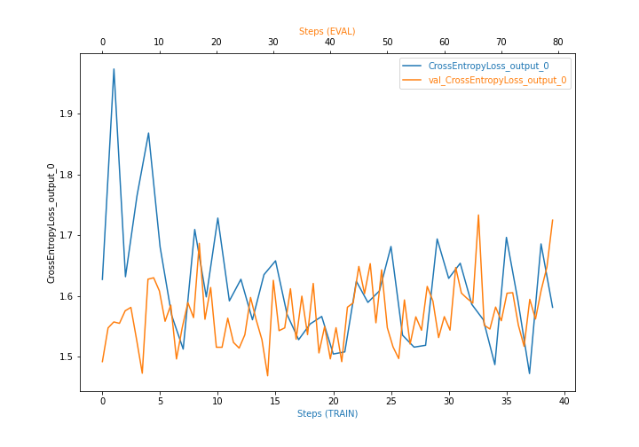
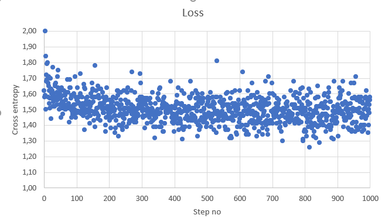
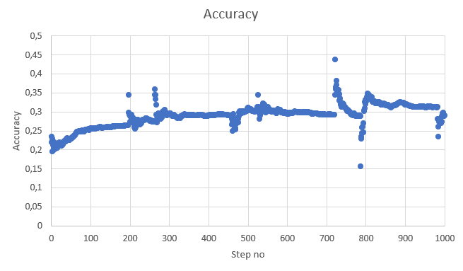

# Inventory Monitoring at Distribution Centers
In modern times logistics and delivery systems are crucial to various parts of the industry. Covid-19 pandemic showed that even short breaks in the logistics chain have huge consequences. Therefore, the big warehouses require reliable and automated system to sort and distribute packages based on multiple characteristics: delivery address, type of material. In these warehouses, packages/objects are usually carried over in boxes, where each box can hold multiple items. The task for the automated delivery system would be to classify the package and determine where to deliver it. But before that the system needs to know how many packages are in each delivery box and that will be the topic of the proposed Capstone project.

In order to count number of objects in a box I make use of [Amazon Bin Image Dataset](https://registry.opendata.aws/amazon-bin-imagery/), which contain photo of the box content and other objects' characteristics including number of objects. Based on this image the implemented solution will estimate number of objects. 

## Project Set Up and Installation
Project is designed to operate sing AWS cloud services such as: S3, SageMaker, Lambda and IAM. In order to properly run the project's code please create an AWS account and clone this repository into your SageMaker notebook instance. All computation units utilized in this project are covered in the free plan of AWS cloud.
Recommended machines are:
- for notebook: ml.t2.medium
- for training: ml.m5.large or ml.m5.xlarge
You can use different instance types for this project, but they might require additional permissions to the AWS cloud.

As AWS cloud is quickly developing and UI is evolving as I write this it is best to refer to [official AWS tutorial](https://docs.aws.amazon.com/sagemaker/latest/dg/howitworks-create-ws.html) for SageMaker instead providing my tutorial which might become outdated quickly. 

## Project files
Project consist of multiple files:
- [`sagemaker.ipynb`](sagemaker.ipynb) -- main project file. Entrypoint
- [`hp_optimization.py`](hp_optimization.py) -- python script for Hyperparameter optimization using Sagemaker
- [`train_model.py`](train_model.py) -- python script for tuning the network. Can be used from Sagemaker or as standalone application
- [`inference.py`](inference.py) -- python script for running model inference
- [`file_list.json`](file_list.json) -- queried for the database to download only part of the dataset

## Dataset
The Amazon Bin Image Dataset contains over 500,000 images and metadata from bins of a pod in an operating Amazon Fulfillment Center. The bin images in this dataset are captured as robot units carry pods as part of normal Amazon Fulfillment Center operations. 
Dataset location: [https://registry.opendata.aws/amazon-bin-imagery/](https://registry.opendata.aws/amazon-bin-imagery/)

### Data selection
In order to speed up training process only a portion of data was selected from the dataset. 
- 1228 images with 1 items in it.
- 2299 images with 2 items in it.
- 2666 images with 3 items in it.
- 2373 images with 4 items in it.
- 1875 images with 5 items in it.

In total 10441 imaged were used. List of specific files is provided in `file_list.json` file.

### Data overview
Sample bin images:



### Data preprocessing
Downloaded data had to be divided into train and validation subsets. For this project images were divided as follow:
- Train: 60%
- Test: 20%
- Valid: 40%

### Access
After preprocessing data are uploaded to `S3` data storage, from where they are accessed for training. 

## Model Training
As a baseline model used resnet50 image classification network. ResNet-50 is a convolutional neural network that is 50 layers deep. In AWS cloud there is available a pretrained version of the network trained on more than a million images from the [ImageNet database]http://www.image-net.org). The pretrained network can classify images into 1000 object categories, such as keyboard, mouse, pencil, and many animals. As a result, the network has learned rich feature representations for a wide range of images. The network has an image input size of 224-by-224.

### Hyperparameters tuning
Before actual training I tried to identify best hyperparameters for the training job. For this I created `hpo.py` script which executes just a single epoch on a part of training data and tests following hyperparameter ranges:
- Learning rate was tuned for range: `(0.001, 0.1)` - found optimal value is `0.0011430449671521476`.
- Batch size was tuned for values: ``{32, 64, 128, 256, 512}`` - found optimal value is `32`.

### Model training procedure
After identification of the potentially best hyperparameters I ran training procedure for this task. The code for the training is provided in `train.py` file. The file is prepared to be working from Sagemaker notebook (example usage in `sagemaker.ipynb`) or as a standalone script which can run on your personal machine or on low-cost spot instances. For the 10000 files the training completed in 5 epochs after 2h of operation.

### Model evaluation and debugging
During training process SageMaker Debugger was enabled and generated following plot:


Nevertheless, using manual debug logging and AWS CloudWatch service we can plot more detailed loss function plot



And accuracy dependency:



As we can see Accuracy of trained network stabilized around value 0.3 - it is not perfect, but let's deploy the model.

## Model deployment
After training model can be deployed and used from different AWS services. Deployment procedure is presented in notebook `sagemaker.ipynb`.

## Model Inference
Using deployed model we can run prediction based on the source images. Let's use sample image such as:


In this image network correctly predicted number of objects to be 4.

Example code for model inference:
```
from PIL import Image
import io

with open("test_image.jpg", "rb") as image:
    f = image.read()
    img_bytes = bytearray(f)
    Image.open(io.BytesIO(img_bytes))
	
response=predictor.predict(img_bytes, initial_args={"ContentType": "image/jpeg"})
```
